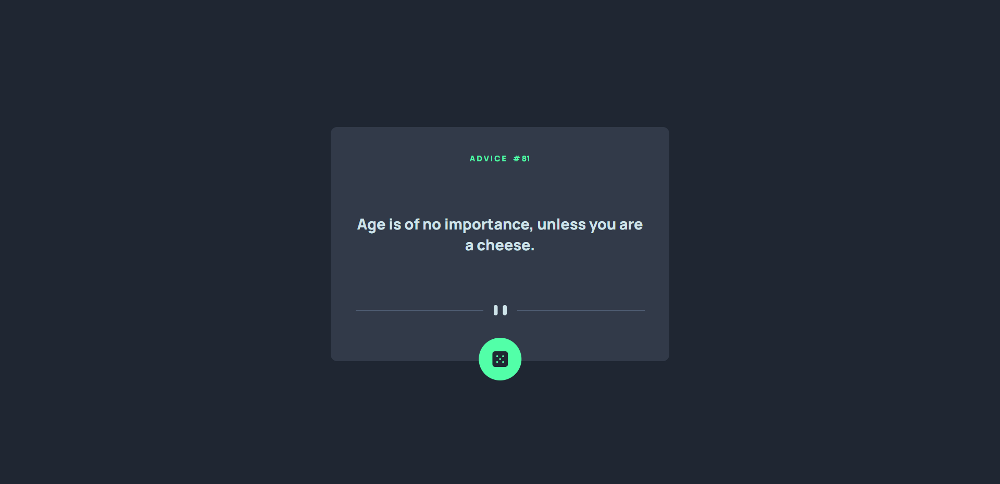
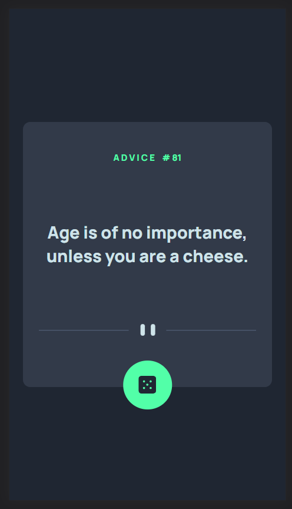

# Frontend Mentor - Advice generator app solution

This is a solution to the [Advice generator app challenge on Frontend Mentor](https://www.frontendmentor.io/challenges/advice-generator-app-QdUG-13db). Frontend Mentor challenges help you improve your coding skills by building realistic projects.

## Table of contents

- [Overview](#overview)
  - [The challenge](#the-challenge)
  - [Screenshot](#screenshot)
  - [Links](#links)
- [My process](#my-process)
  - [Built with](#built-with)
  - [What I learned](#what-i-learned)
- [Author](#author)

## Overview

### The challenge

Users should be able to:

- View the optimal layout for the app depending on their device's screen size
- See hover states for all interactive elements on the page
- Generate a new piece of advice by clicking the dice icon

### Screenshot

Desktop

Mobile

### Links

- Solution URL: [Add solution URL here]([https://your-solution-url.com](https://www.frontendmentor.io/solutions/advicegeneratorappmain-with-html5-css3-and-js-JtISBJm3Yy
))

## My process

### Built with

- Semantic HTML5 markup
- CSS custom properties
- Flexbox
- CSS Grid
- Mobile-first workflow
- Vanilla JS(ES6)

### What I learned

This was a very good challenge to reinforce my fetch API skills with JS. I did it with .then method.

## Author

- Frontend Mentor - [@leodev9911](https://www.frontendmentor.io/profile/leodev9911)
- Twitter - [@leodev9911](https://twitter.com/leodev9911)

